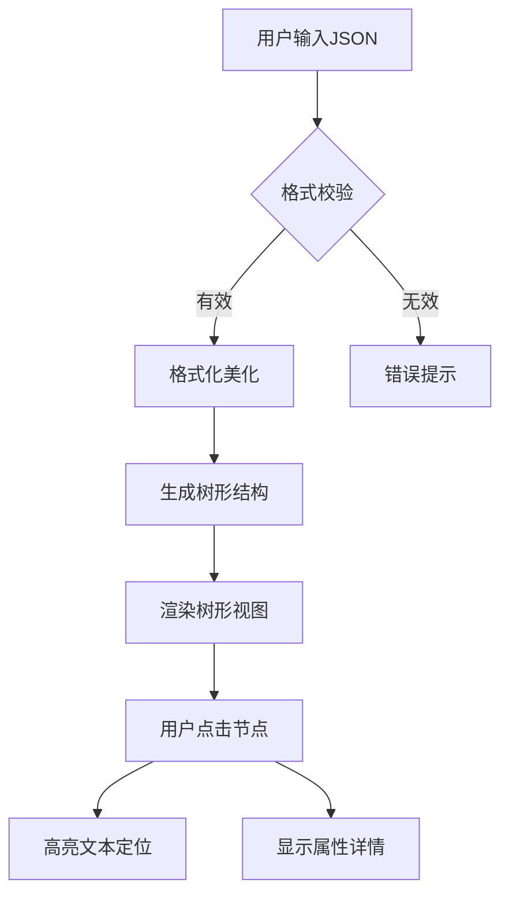

## 1. Product Overview
在线JSON格式化与结构化预览工具，面向开发者和数据处理人员，支持JSON文本的美化、校验、树形可视化、属性详情查看，提升JSON数据的阅读与调试效率。

## 2. Core Features

### 2.1 User Roles
| Role | Registration Method | Core Permissions |
|------|---------------------|------------------|
| 用户 | 无需注册 | 使用所有核心功能 |

### 2.2 Feature Module
1. **JSON编辑器**：文本输入/编辑、语法高亮、实时校验
2. **树形视图**：层级展开/折叠、搜索定位、节点联动
3. **属性面板**：键值对展示、数据类型识别、特殊类型预览

### 2.3 Page Details
| Page Name | Module Name | Feature description |
|-----------|-------------|---------------------|
| JSON预览首页 | 左侧编辑器 | JSON文本输入、格式化、压缩、转义/去转义、复制 |
| JSON预览首页 | 中间树形视图 | 树状层级展示、折叠/展开、搜索定位、节点联动 |
| JSON预览首页 | 右侧属性面板 | 键值对表格展示、数据类型识别、URL跳转 |

## 3. Core Process
用户在左侧粘贴/输入JSON → 点击格式化或自动校验 → 中间树形视图和右侧属性面板同步更新。点击树节点 → 左侧文本区定位高亮，右侧显示属性详情。

## 4. User Interface Design
### 4.1 Design Style
- 主色调：深蓝色系(#1e3a5f)，科技感配色
- 按钮样式：圆角矩形，hover状态增强
- 字体：等宽字体(Monaco/Consolas)用于代码区，常规字体用于面板
- 布局：三栏式布局，可拖拽调整宽度
- 图标：简洁线条风格

### 4.2 Page Design Overview
| Page Name | Module Name | UI Elements |
|-----------|-------------|-------------|
| JSON预览首页 | 左侧编辑器 | 工具栏(复制/格式化/压缩/转义)、文本编辑区、语法高亮、错误提示 |
| JSON预览首页 | 中间树形视图 | 搜索框、GO按钮、上下切换、展开/收缩按钮、树节点、±控制按钮 |
| JSON预览首页 | 右侧属性面板 | 表格(Name/Value列)、数据类型标识、URL链接样式 |

### 4.3 Responsiveness
- 桌面优先设计
- 支持三栏宽度拖拽调整
- 小屏幕自动调整布局

### 4.4 3D Scene Guidance
无3D场景需求