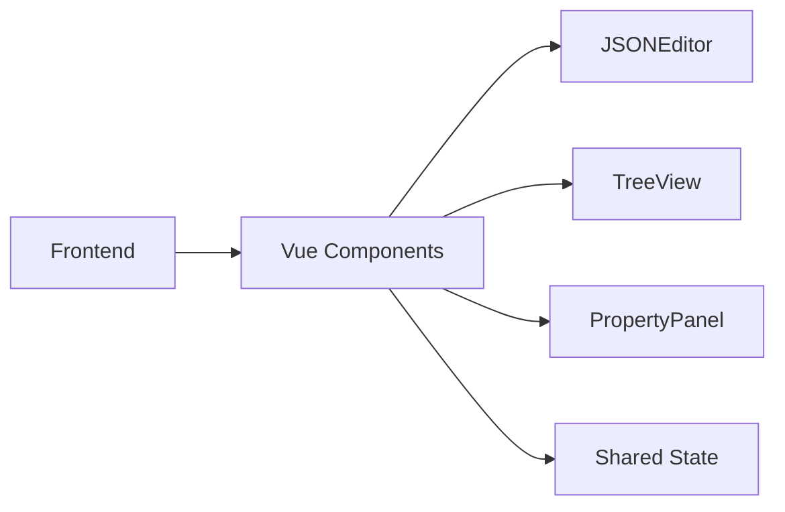
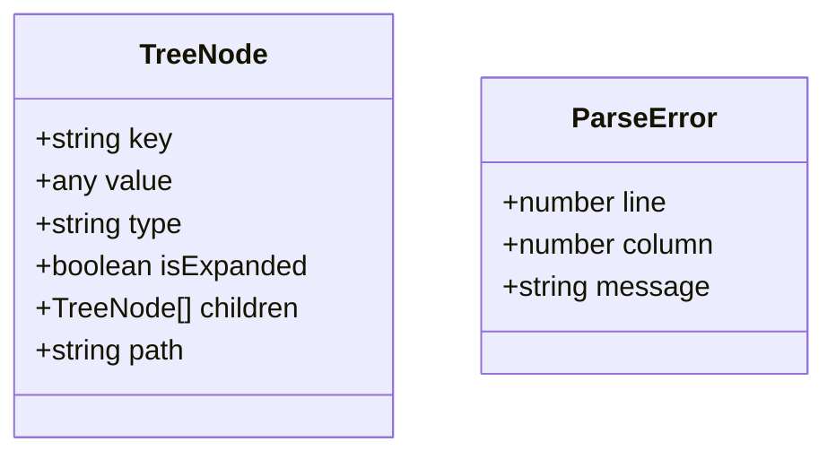

## 1. Architecture Design


## 2. Technology Description
- Frontend: Vue@3 + tailwindcss@3 + vite
- Initialization Tool: vite-init
- Backend: None (纯前端工具)
- Database: None

## 3. Route Definitions
| Route | Purpose |
|-------|---------|
| / | JSON预览首页 |

## 4. API Definitions
无后端API需求

## 5. Server Architecture Diagram
无后端服务

## 6. Data Model
### 6.1 Data Model Definition


### 6.2 Data Definition Language
无数据库表需求

## 7. Component Structure
```
src/
├── components/
│   ├── JsonEditor.vue      # JSON文本编辑器
│   ├── TreeView.vue        # 树形结构视图
│   ├── TreeNode.vue        # 树节点组件
│   └── PropertyPanel.vue   # 属性详情面板
├── utils/
│   └── jsonParser.ts       # JSON解析工具
├── composables/
│   └── useJsonPreview.ts   # JSON预览状态管理
├── App.vue
├── main.ts
└── style.css
```

## 8. Core Functions
| Function | Description |
|----------|-------------|
| formatJson | 美化JSON，添加缩进和换行 |
| compressJson | 压缩JSON为单行 |
| escapeJson | 压缩并转义特殊字符 |
| unescapeJson | 去除转义 |
| parseJson | 解析JSON并生成树结构 |
| searchNodes | 搜索树节点 |
| highlightNode | 高亮匹配节点 |